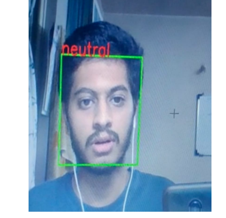
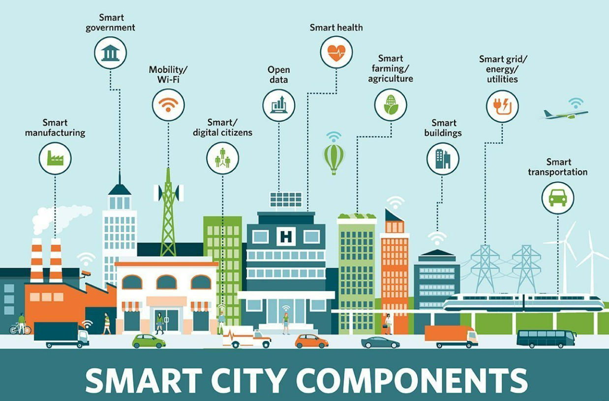
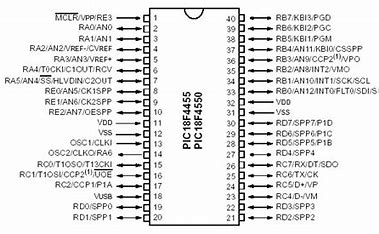

  <header class="post-header">
    <!-- <h1 class="post-title">Projects</h1> -->
  </header>
  <article>
    

        <ol class="list-unstyled">
            <a href="/projects/Movie_review_NLP/">
                <li class="card hoverable d-flex flex-row" style="margin-bottom: 20px;">
                    

                        
                    

                    

                        <h3 class="card-title">Movie Review Sentiment Analysis</h3>
                        
NLP -  Sentiment Analysis of moview reivews by logistic regression

                    

                </li>
            </a>
            <a href="/projects/youtube-statistics/">
                <li class="card hoverable d-flex flex-row" style="margin-bottom: 20px;">
                    

                        
                    

                    

                        <h3 class="card-title">Youtube Statistics EDA and Earnings Prediction (Python)</h3>
                        
Analyzing YouTube statistics to predict earnings and offer strategic insights for content creators.

                    

                </li>
            </a>
            <a href="/projects/fer_cnn/">
                <li class="card hoverable d-flex flex-row" style="margin-bottom: 20px;">
                    

                        
                    

                    

                        <h3 class="card-title">Facial Emotion Recognition (Python)</h3>
                        
A real-time facial emotion recognition system using CNNs, achieving enhanced emotion prediction accuracy from video streams

                    

                </li>
            </a>
            <a href="/projects/cloud-smartcity/">
                <li class="card hoverable d-flex flex-row" style="margin-bottom: 20px;">
                    

                        
                    

                    

                        <h3 class="card-title">Cloud-Native Smart City using AWS</h3>
                        
Cloud Computing - Architecture for a Smart City

                    

                </li>
            </a>
            <a>
            <li class="card hoverable d-flex flex-row" style="margin-bottom: 20px;">
                

                    
                

                

                    <h3 class="card-title">Crop Protection From Heavy Rainfall (Embedded C)</h3>
                    
Developed an embedded system using a PIC microcontroller, humidity and temperature sensors to predict heavy rainfall. Designed a PCB and prototyped the system. Triggers automating the activation of the DC motor occurred when heavy rainfall was predicted, serving as an integral function within the crop covering mechanism.

                

            </li>
            </a>
        </ol>
    

  </article>

